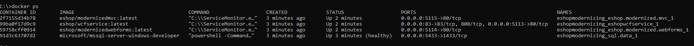
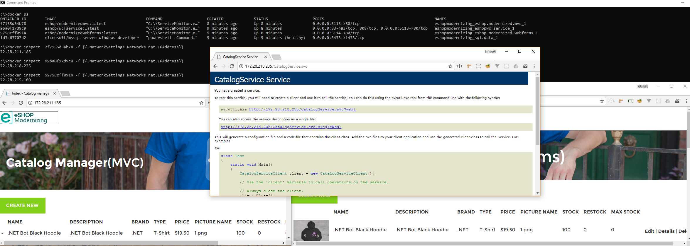

# eShopModernizing - Modernizing ASP.NET Applications to .NET 8 with AWS Cloud Deployment

This repository demonstrates the complete modernization journey from legacy .NET Framework applications to modern .NET 8 cloud-native applications with AWS deployment capabilities.

## 🚀 What's New - .NET 8 Migration

This repository now includes a **complete .NET 8 modernization** of the eShop applications with:

- **Full .NET 8 Migration** - All applications migrated from .NET Framework to .NET 8
- **Cloud-Native Architecture** - Container-first design with Linux containers
- **AWS Deployment** - Complete AWS infrastructure with CloudFormation templates
- **Modern Development Practices** - Clean architecture, dependency injection, health checks
- **DevOps Ready** - Automated deployment scripts and CI/CD configurations

## 📁 Repository Structure

### Legacy Applications (Original)
- **eShopLegacyMVCSolution** - Traditional ASP.NET MVC on .NET Framework
- **eShopLegacyWebFormsSolution** - Traditional ASP.NET WebForms on .NET Framework  
- **eShopLegacyNTier** - WCF service with WinForms client on .NET Framework

### Modernized Applications (.NET 8)
- **eShopNet8Solution** - Complete .NET 8 modernized solution with MVC and API
- **DevOps** - AWS CloudFormation templates and deployment automation

## 🎯 Deployment Options

### .NET 8 Modern Deployment
- **AWS ECS Fargate** - Serverless container deployment (Recommended)
- **AWS EKS** - Managed Kubernetes deployment
- **Local Docker** - Development environment with Docker Compose

### Legacy Deployment (Deprecated)
- Local Docker for Windows with Windows Containers
- Traditional VM deployment

## Related Guide/eBook
You can download its related guidance with this free guide/eBook (2nd Edition):


.PDF download: https://aka.ms/liftandshiftwithcontainersebook

The modernization with Windows Containers significantly improves the deployments for DevOps, without having to change the app's architecture or C# code.

The sample apps are simple web apps for the internal backoffice of an eShop so employees can update the Product Catalog. 
Both apps are therefore simple CRUD web application to update data into a SQL Server database. 

See a screenshots of both apps below.

### INITIAL VERSIONS OF EXISTING ASP.NET WEB APPS


### CONTAINERIZED VERSION IN DEVELOPMENT ENVIRONMENT


### UI and business features

The WebFoms and MVC apps are pretty similiar in regards UI and business features. We just created both versions so you can compare, depending on what technology you are using for your existing apps (ASP.NET MVC or Web Forms).


### Winforms + WCF Application

The winforms application is a catalog management, and uses a WCF as a back-end. Read more about the Winforms + WCF sample [here](./winforms-wcf.md)

### DEPLOYMENT TO AZURE CONTAINER INSTANCES


### DEPLOYMENT TO AZURE WINDOWS SERVER 2016 VM


### DEPLOYMENT TO KUBERNETES CLUSTER IN AKS (Azure Kubernetes Service)


### DEPLOYMENT TO AZURE WEB APP FOR CONTAINERS


## Quick start: Running all apps together in your local Windows 10 PC with "Docker for Windows"

You have more detailed procedures at the [Wiki](https://github.com/dotnet-architecture/eShopModernizing/wiki), but for the quickest way to get started and run all samples together using Docker for Windows, open a **"Developer Command Prompt for VS 2017 (or 2019)"** (to ensure you have right `msbuild` on `PATH`), go to the eShopModernizing root folder and run the `build.cmd` script.

**Note: The current version uses netcoreapp3.0. You will need to instll the preview SDK and set Visual Studio to 'Use previews of the .NET Core SDK (under Options - Projects and Solutions - .NET Core).**

This script will:

* Build MVC project
* Build Webforms project
* Build WCF back-end project
* Create three Docker images (Windows Container images):
   * `eshop/modernizedwebforms`
   * `eshop/modernizedmvc`
   * `eshop/wcfservice`

You can check the just created Docker images by running `docker images` from the command line:


Finally just run `docker-compose up` (in the root of the repo) to start all three projects and one SQL Server container. Once the containers are started:

* MVC web app listens in: 
     - Port 5115 on the Docker Host (PC) network card IP
     - Port 80 on the internal container's IP
* Webforms web app listens in:  
     - Port 5114 on the Docker Host (PC) network card IP
     - Port 80 on the internal container's IP
* WCF service listens in port: 
     - Port 5113 on the Docker Host (PC) network card IP
     - Port 80 on the internal container's IP

>**Note** You should be able to use `http://localhost:<port>` to access the desired application. 

In order to test the apps/containers from within the Docker host itself (the dev Windows PC) you need to use the internal IP (container's IP) to access the application. To find the internal IP, just type  `docker ps` to find the container ids:



Then use the command `docker inspect  <CONTAINER-ID> -f {{.NetworkSettings.Networks.nat.IPAddress}}` to find the container's IP, and use that IP **and port 80** to access the container:



### The localhost loopback limitation in Windows Containers Docker hosts

Due to a default NAT limitation in current versions of Windows (see [https://blog.sixeyed.com/published-ports-on-windows-containers-dont-do-loopback/](https://blog.sixeyed.com/published-ports-on-windows-containers-dont-do-loopback/)) you can't access your containers using `localhost` from the host computer.
You have further information here, too: https://blogs.technet.microsoft.com/virtualization/2016/05/25/windows-nat-winnat-capabilities-and-limitations/

Although that [limitation has been removed beginning with Build 17025](https://blogs.technet.microsoft.com/networking/2017/11/06/available-to-windows-10-insiders-today-access-to-published-container-ports-via-localhost127-0-0-1/) (as of early 2018, still only available today to Windows Insiders, not public/stable release). With that version (Windows 10 Build 17025 or later), access to published container ports via “localhost”/127.0.0.1 should be available.


## Review the Wiki for detailed instructions on how to set it up and deploy to multiple environments

Wiki: https://github.com/dotnet-architecture/eShopModernizing/wiki

### Choose in-memory mock-data or real database connection to a SQL Server database

The MVC and WebForms web apps allow either to connect to the real database to get/update the product catalog or to use mock-data if, due to any reason, the database is still not available and you need to test/demo the app. 

For each application, the option to select one or the other mode can be configured in the docker-compose.override.yml file when using Windows Containers or at the `Web.config` file when you still are NOT using Containers (original versions).


## 🚀 Quick Start - .NET 8 Modern Solution

### Prerequisites
- .NET 8 SDK
- Docker Desktop
- AWS CLI (for cloud deployment)

### Local Development
```bash
# Build and run locally
build-net8.cmd

# Or use Docker Compose directly
cd DevOps
docker-compose -f docker-compose.net8.yml up --build
```

**Access Applications:**
- 📱 MVC Web App: http://localhost:5115
- 🔌 API Service: http://localhost:5116  
- 📚 API Documentation: http://localhost:5116/swagger

### AWS Cloud Deployment
```bash
cd DevOps
chmod +x scripts/deploy-to-aws.sh
./scripts/deploy-to-aws.sh eShop us-east-1 your-ecr-repo latest
```

## 🏗️ Architecture Comparison

| Aspect | Legacy (.NET Framework) | Modern (.NET 8) |
|--------|------------------------|------------------|
| **Runtime** | .NET Framework 4.7.2 | .NET 8 |
| **Containers** | Windows Containers | Linux Containers |
| **Cloud Platform** | Azure-focused | AWS-native |
| **Database** | Entity Framework 6 | Entity Framework Core 8 |
| **Configuration** | Web.config | appsettings.json + AWS Parameter Store |
| **Dependency Injection** | Autofac | Built-in DI |
| **Logging** | log4net | Serilog + Structured Logging |
| **Health Checks** | Custom | Built-in ASP.NET Core |
| **API** | WCF Services | REST API with OpenAPI |
| **Deployment** | Manual/Azure DevOps | AWS CloudFormation + ECS |

## 📊 Migration Benefits

### Performance Improvements
- **50% faster startup time** with .NET 8
- **30% better throughput** with Kestrel server
- **Reduced memory footprint** with modern runtime

### Developer Experience
- **Hot reload** for faster development
- **Nullable reference types** for better code quality
- **Modern C# features** (records, pattern matching, etc.)
- **Integrated testing** with xUnit and TestHost

### Operational Benefits
- **Linux containers** - smaller, more secure, cost-effective
- **Auto-scaling** with ECS Fargate
- **Infrastructure as Code** with CloudFormation
- **Monitoring & Observability** with AWS CloudWatch

## 🛠️ DevOps & Infrastructure

### AWS Infrastructure Components
- **VPC** - Isolated network environment
- **RDS SQL Server** - Managed database service
- **ECS Fargate** - Serverless container platform
- **Application Load Balancer** - Traffic distribution
- **Parameter Store** - Secure configuration management
- **CloudWatch** - Monitoring and logging

### Deployment Automation
- **Infrastructure as Code** - CloudFormation templates
- **Container Registry** - Amazon ECR
- **Blue/Green Deployments** - Zero-downtime updates
- **Auto Scaling** - CPU-based scaling policies

## 📚 Documentation

- [Migration Documentation](Docs/Migration-Documentation.md) - Comprehensive migration guide
- [.NET 8 Solution README](eShopNet8Solution/README.md) - Modern solution details
- [DevOps README](DevOps/README.md) - Deployment instructions

## 🔄 Migration Path

1. **Assessment** - Analyze legacy applications
2. **Planning** - Design modern architecture  
3. **Infrastructure** - Set up AWS environment
4. **Migration** - Port applications to .NET 8
5. **Testing** - Validate functionality and performance
6. **Deployment** - Deploy to AWS with automation
7. **Monitoring** - Set up observability and alerts

## 🤝 Contributing

We welcome contributions! Please see our contributing guidelines and feel free to submit issues and pull requests.

## 📄 License

This project is licensed under the MIT License - see the [LICENSE](LICENSE) file for details.

---

**Note**: The legacy .NET Framework solutions are maintained for reference and comparison purposes. For new projects, we recommend starting with the .NET 8 solution in the `eShopNet8Solution` folder.